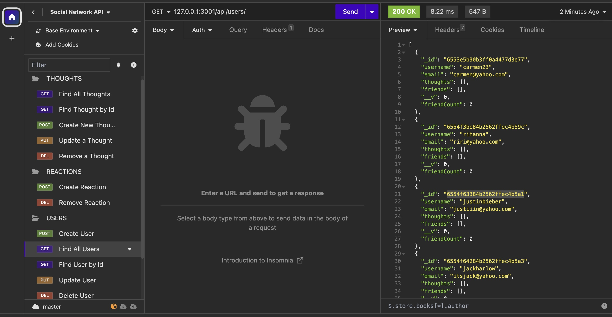

# Social Network API

## Description

This application allows social media companies/startups to handle large amounts of unstructured data on their website.  

## Installation

To invoke this application, run nodemon server.js or node server.js in intergrated terminal.

## Usage

This application can be used to view and edit large amounts of unstructured data to carry out any and all of the following tasks: create a user, find users, find a specific user by ID, update and/or delete a user, add and/or remove friends, create and/or remove a reaction, create a thought, find thoughts, find a specific thought by ID, and lastly, update and/or remove a thought.

[Link to Video with Social Network API walk-through](https://youtu.be/xffCFcZaM9c)

## Credits

Collaborated with Leif Hetland, my tutor, and coding bootcamp peers during office hours.

## License

Please refer to the LICENSE in the repo.